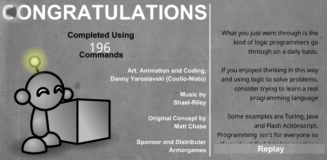
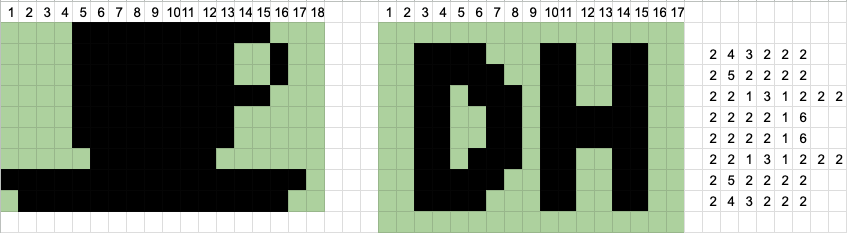

# Digital House: imperative programming

- Class 01: [Light-Bot](https://armorgames.com/play/2205/light-bot)  
  

- Class 02: El primer número se refiere
  siempre al número de píxeles de color blanco. Si el primer pixel es de color negro la línea comenzará con un cero.
  
